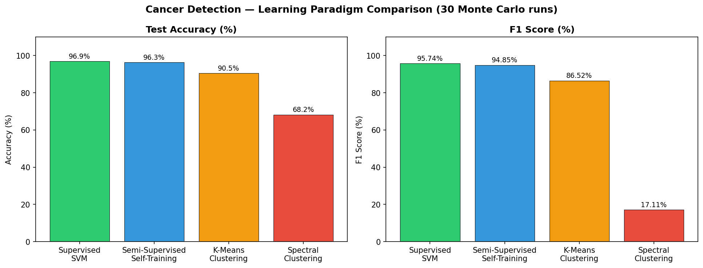

# Cancer and Fraud Detection — How Much Labeled Data Do You Really Need?

Two experiments exploring how classification performance changes when you have fewer labeled examples — using breast cancer diagnosis and banknote fraud detection as test cases.

---

## Part 1 — Breast Cancer Detection: 4 Ways to Train a Classifier

**Dataset**: Breast Cancer Wisconsin — 569 samples, 30 features, binary label (Benign / Malignant)

Four approaches compared on the same dataset over 30 randomized runs:

| Method | How many labels used | Test Accuracy | F1 Score |
|--------|----------------------|---------------|----------|
| Supervised SVM | All | 96.9% | 95.74% |
| Self-Training (semi-supervised) | 50% | 96.3% | 94.85% |
| K-Means Clustering | None | 90.5% | 86.52% |
| Spectral Clustering | None | 68.2% | 17.11% |

**Key findings:**
- Using only 50% of labels (self-training) loses less than 1% accuracy — labels are less scarce than expected for this dataset
- K-Means with no labels still reaches 90.5% by assigning cluster labels via majority voting
- Spectral Clustering failed — it assigned almost all points to one cluster, making recall collapse to 14%

---

## Part 2 — Banknote Fraud Detection: Active vs. Random Sampling

**Dataset**: Banknote Authentication — 900 training, 472 test samples, 4 features

**Question**: If you can only label a limited number of examples, which ones should you pick?

- **Passive learning**: pick training examples randomly
- **Active learning**: always pick the examples the model is most uncertain about (closest to the decision boundary)

Both trained with L1-SVM, evaluated over 50 Monte Carlo runs.

**Result**: Active learning reaches the same accuracy as passive learning with fewer labeled examples — especially visible in the early part of the learning curve.

---

## Tools

- `scikit-learn` — SVM, KMeans, SpectralClustering, metrics
- `numpy`, `pandas`, `matplotlib`

---

## Future Work

- Explain spectral clustering failure — tune γ parameter, visualize cluster assignments
- Try label propagation as an alternative semi-supervised method
- Quantify exactly how many fewer labels active learning needs to match passive
