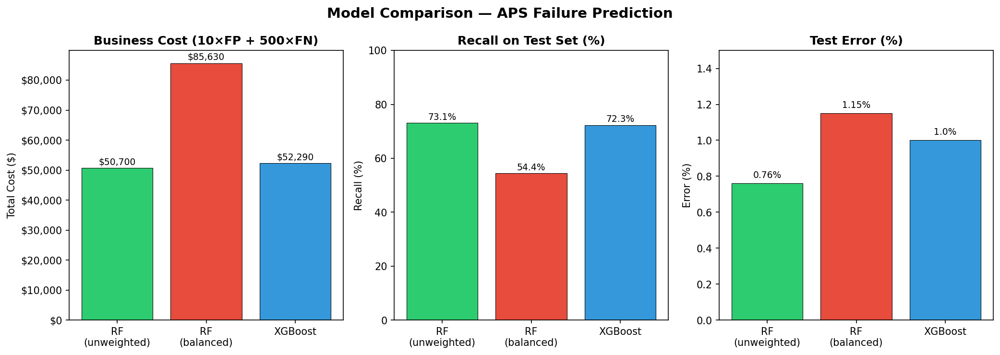

# APS Failure Prediction Using Tree-Based Models & SMOTE

Predicting rare Air Pressure System (APS) failures in Scania trucks — a highly imbalanced classification problem with real business cost constraints.

---

## Dataset

- **Source**: APS Failure at Scania Trucks — UCI ML Repository
- **Training set**: 60,000 rows, 1,000 positive (failure) cases (1.7% positive rate)
- **Test set**: 16,000 rows, 375 positive cases
- **Features**: 170 anonymized numeric sensor readings + 1 binary label
- **Missing values**: ~10% of entries, imputed using column means

---

## Problem & Cost Metric

A missed failure (false negative) costs **$500** in unplanned repairs.
A false alarm (false positive) costs **$10** in unnecessary inspection.

**Total Cost = 10 × FP + 500 × FN**

This asymmetric cost makes standard accuracy a poor evaluation metric.

---

## Approach

### 1. Exploratory Data Analysis
- Computed Coefficient of Variation (CV) for all 170 features
- Selected top √170 ≈ 13 highest-CV features for visualization
- Confirmed severe class imbalance: 74,625 negative vs 1,375 positive (54:1 ratio)

### 2. Random Forest (Baseline)
- Default class distribution, 100 trees, OOB scoring enabled
- Test misclassification: **0.76%**, OOB error: **0.60%**

### 3. Random Forest (Class-Weighted)
- `class_weight='balanced'` — weights inversely proportional to class frequency
- Test misclassification: **1.15%**, OOB error: **0.77%**

### 4. XGBoost with L1 Regularization
- Regularization parameter α tuned via 10-fold cross-validation
- Best α = 10, test error: **1.0%**

### 5. XGBoost + SMOTE
- SMOTE applied inside CV folds to prevent data leakage
- Best α selected via GridSearchCV, test error: **1.07%**

---

## Results

| Model | FP | FN | Recall | Test Error | Business Cost |
|-------|----|----|--------|------------|---------------|
| RF (unweighted) | 20 | 101 | 73.1% | 0.76% | **$50,700** |
| RF (balanced) | 13 | 171 | 54.4% | 1.15% | $85,630 |
| XGBoost | 29 | 104 | 72.3% | 1.0% | $52,290 |

**Key finding**: The class-weighted model reduces false positives but sharply increases false negatives — which cost 50× more. By the business cost metric, the **unweighted Random Forest wins** despite having lower recall.

OOB error closely tracks test error across all Random Forest models, confirming reliable generalization estimates without a held-out set.

---

## Tools & Libraries

- `scikit-learn` — RandomForestClassifier, SimpleImputer, metrics
- `xgboost` — XGBClassifier with L1 regularization
- `imbalanced-learn` — SMOTE
- `pandas`, `NumPy`, `matplotlib`, `seaborn`

---

## Future Work

- Evaluate with SHAP values for feature interpretability
- Benchmark SMOTE vs ADASYN vs BorderlineSMOTE
- Try LightGBM or CatBoost for native imbalance handling
- Optimize directly on business cost rather than accuracy
